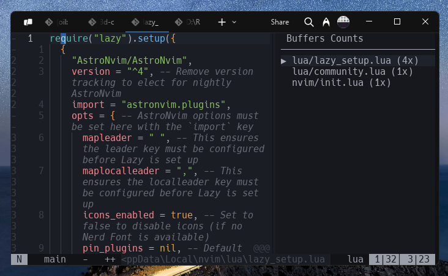

# buffcount.nvim



this plugin aim to enhance clarity about every opened buffers, provide clear ranking to the most opened buffer.

- clarity is priority
- memorize filepath better
- easy to re-open with tools like `telescope.nvim`

## installation

### `lazy.nvim`

```lua

return {
  -- ...
  {
    "naranyala/buffcounts.nvim",
    config = function()
      require("buffcount").setup {
        min_width = 25,
        max_width = 80,
      }

      -- reset every open project and show the sidebar/panel
      vim.cmd [[BuffCountReset]]
      vim.cmd [[BuffCountToggle]]
    end
  }
  -- ...
}

```

## enjoy
